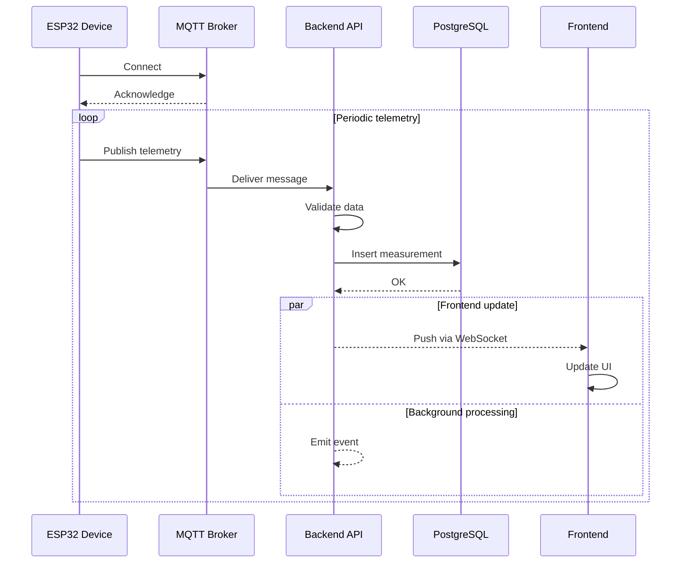
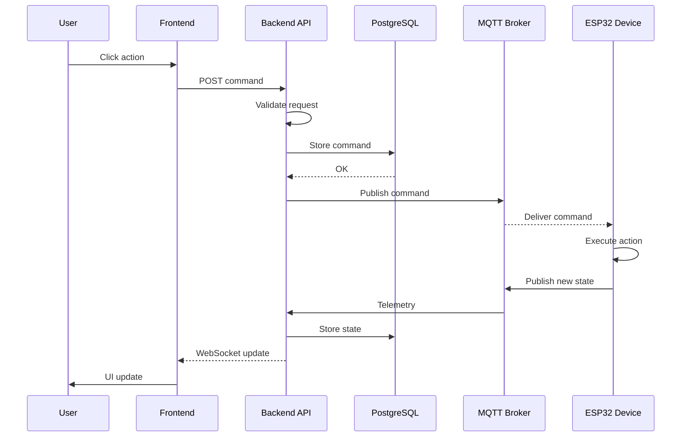

## 🔄 High-Level Flow

```mermaid
flowchart LR

    subgraph Device[ESP32 Device]
        S1[Read sensors]
        S2[Format telemetry JSON]
        S3[Publish telemetry]
        S4[Receive commands]
        S5[Actuate outputs]
    end

    subgraph Backend[Backend API]
        B1[Receive telemetry]
        B2[Validate data]
        B3[Store in PostgreSQL]
        B4[Expose REST and WebSockets]
        B5[Store commands]
        B6[Publish commands]
    end

    subgraph DB[(PostgreSQL)]
        D1[Measurements]
        D2[Devices]
        D3[Commands]
        D4[Users]
    end

    subgraph Services[Background Services]
        SV1[Data processor]
        SV2[Alerts service]
    end

    subgraph Frontend[Frontend Dashboard]
        F1[User login]
        F2[Fetch device list]
        F3[Subscribe to live data]
        F4[Display charts]
        F5[Send command]
    end


    %% Telemetry path
    S1 --> S2 --> S3 --> B1 --> B2 --> B3 --> D1

    %% Backend to DB relations
    B3 --> D2
    B3 --> D3
    B3 --> D4

    %% Services processing
    D1 --> SV1 --> SV2

    %% Frontend data access
    F1 --> B4
    F2 --> B4
    F3 --> B4
    B4 --> D1
    B4 --> D2
    B4 --> D3
    B4 --> D4
    D1 --> F4

    %% Command path
    F5 --> B5 --> D3 --> B6 --> S4 --> S5

```

## 📡 Sequence Diagram – Telemetry from Device to Dashboard


## 🧭 Sequence Diagram – User Sends Command to Device

